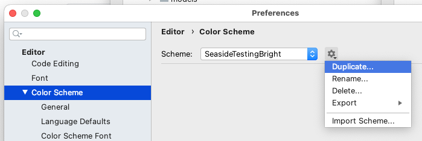

# seasidetesting-bright
A RubyMine (and other JetBrains IDE) colour scheme I use for Ruby and Rails development

To install:

* Clone the repository (od download the `icls` file.
* In your IDE goto `Preferences` -> `Color Scheme`.
  In the displayed dislog click the 'cog whell' icon and then 'Import Scheme…'

  
